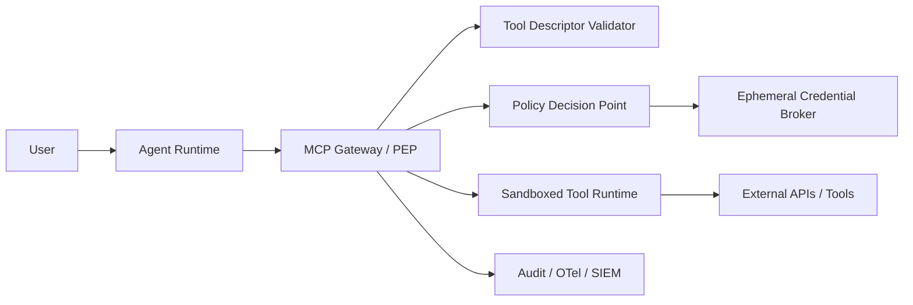

# Reference Architecture: MCP + RAG Customer Support Agent

**Scenario:** Enterprise customer support agent built with LangGraph. It uses MCP tools for CRM lookup, refund initiation, email sending, and ticket updates. It also uses a vector database for long-term support memory and retrieves external knowledge-base pages.

## Recommended architecture patterns
- **MCP Runtime Security Gateway** (`mcp_runtime_security_gateway`) — covers ASI01, ASI02, ASI03, ASI04, ASI05, ASI07
- **Enterprise Agent Governance Control Plane** (`enterprise_agent_governance_control_plane`) — covers ASI03, ASI04, ASI07, ASI08, ASI10

## Mermaid diagram

## Core components
- Agent Runtime
- MCP Gateway / PEP
- Tool Descriptor Validator
- Policy Decision Point
- Ephemeral Credential Broker
- Sandboxed Tool Runtime
- Audit / OTel / SIEM
- Agent Registry
- Capability Cards
- Policy Registry
- NHI / Token Broker
- A2A Trust Graph
- Telemetry Lake
- Governance Dashboard

## Security controls
- tool descriptor validation
- least privilege tool scopes
- per-action authorization
- sandboxed execution
- egress allowlist
- immutable tool-call audit
- agent inventory
- signed capability manifests
- policy versioning
- NHI lifecycle
- attested A2A trust graph
- quarterly evidence review

## ASI risk coverage
ASI01, ASI02, ASI03, ASI04, ASI05, ASI06, ASI07, ASI08, ASI10

## Open validation tasks
- Verify each tool claim with `agents/claim_verifier.py`.
- Run benchmark cases selected by `agents/validation_loop.py`.
- Attach benchmark-backed evidence before increasing coverage depth to 3.
